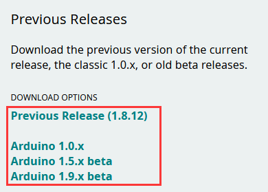
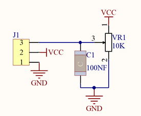

# Arduino C教程

## 开发环境配置

### 第一小节 在Windows系统电脑详细使用方法


（1）安装Arduino IDE

你可以进入以下网址下载Arduino IDE：<https://www.arduino.cc/>，点击后，显示如下图。


点击下图，


就可以下载最新版本的IDE，同时我们可以点击下图，选择你需要的版本IDE。



我们选择安装1.8.13版本Arduino IDE，当我们点击，代表下载安装文件(.exe)，需要手动安装。当我们点击，代表直接下载1.8.12版本Arduino IDE，是一个压缩文件，解压就可以使用，无需安装。


（2）安装驱动文件

软件下载完毕，我们开始为Uno Plus 开发板安装驱动。Uno Plus开发板的USB转串口芯片用的是著名的CP2102 芯片，在ARDUINO开发软件1.8以上的版本里就已经包含了这个芯片的驱动程序，这样我们使用起来会非常方便。一般插上USB，电脑就会识别到硬件，WINDOWS就会自动安装CP2102的驱动。

如果驱动安装不成功，或者你想手动安装驱动，请打开电脑的设备管理器

显示CP2102的驱动没有安装成功，有一个黄色的感叹号。我们双击硬件更新驱动


浏览计算机查找驱动程序，先找到我们安装或者下载的ARDUINO开发软件


里面有个dirvers文件夹，打开文件夹就能看到CP210X系列芯片的驱动，


我们选择这个文件夹，然后点击确定，驱动安装成功。


这个时候再打开设备管理器，我就可以看到CP2102的驱动程序已经安装成功了，刚刚的那个黄色的感叹号不见了。


（3）Arduino IDE设置和工具栏介绍

首先我们点击文档中的图标，打开Arduino IDE。


为了避免在将程序上载到板上时出现任何错误，必须选择正确的Arduino板名称，该名称与连接到计算机的电路板相匹配。转到Tools→Board，然后选择你的板。


然后再选择正确的COM口（安装驱动成功后可看到对应COM口）。


我们的程序上传到板之前，我们必须演示Arduino IDE工具栏中出现的每个符号的功能。


A - 用于检查是否存在任何编译错误。

B - 用于将程序上传到Arduino板。

C - 用于创建新草图的快捷方式。

D - 用于直接打开示例草图之一。

E - 用于保存草图。

F - 用于从板接收串行数据并将串行数据发送到板的串行监视器。

（4）启动你的第一个程序

打开文件选择例子，选择第一个文件BASIC里面的BLINK程序


按照前面方法设置板和COM口，IDE右下角显示对应板和COM口。


点击图标开始编译程序，检查错误，检查无误。


点击点击图标开始上传程序，上传成功。


程序上传成功，板载的LED灯亮一秒钟，灭一秒钟，恭喜你的第一个程序完成了！


### 第二小节 在MAC系统电脑详细使用方法


（1）下载安装Arduino IDE 

不同的系统，需要下载不同的Arduino IDE，下载方式和第二小节类似。选择如下图。


（2）驱动安装方法

打开目录下的mac驱动文件夹，双击SiLabsUSBDriverDisk.dmg文件


可以看到以下文件


双击 Install CP210x VCP Driver ，接着勾上Don’t warn me ，点击Open


点击Continue


继续点击Continue ，然后点击Agree


点击Continue ，然后输入你的用户密码


系统安全问题，需要允许安装，点击 Open Security Preferences


点击安全锁 ，输入你的用户密码来授权


看到锁被打开了，点击Allow


回到安装界面，根据提示等待安装


安装成功


（3）Arduino IDE设置

在 Arduino IDE设置时，方法和5.3章节类似，只是设置COM口时不同，如下图。


### 第三小节 库文件的添加

在开始课程之前我们还需要安装课程里面代码需要的Arduino库文件。

(1)什么是库文件?

库是一组代码，可以方便地连接到传感器、显示器、模块等。例如，内置的LiquidCrystal库可以帮助与LCD显示器对话。Internet上还有数百个额外的库可供下载。参考资料(https://www.arduino.cc/en/Reference)中列出了内置库和其中一些附加库。

(2)如何安装库 ?

这里我们将介绍一种最简单的添加库的方法 .

第一步：打开文件的安装目录，如下所示：


第二步：单击打开安装目录下的libraries文件夹，你可以看到library这个文件夹里面含有一些Arduino的库文件。


第三步：打开我们提供资料里面的库文件夹，将文件夹中的库文件解压然后都复制粘贴到第二步我们打开的libraries文件夹内。


复制好了之后我们的库文件就添加成功了。

这样，库文件就手动添加完成了。

arduino IDE 2.0及以上版本如何安装库?

如果你使用的是arduino IDE 2.0及以上版本添加库文件的方法有所不同。方法如下：

第一步：打开arduino IDE软件

第二步：按照图片的顺序依次点击


第三步：完成第二步后我们会进入一个选择文件的对话框，软后找到我们教程文件夹里的库文件夹，选择需要添加的库文件压缩包，点击打开，然后arduino IDE会提示已安装，这样我们就将库文件安装好了。


## 项目课程

### 第1课 蜂鸣器模块


1.  项目介绍：

本模块兼容各种单片机控制板，如arduino、microbit等等。它的连接端口兼容arduino传感器扩展板。它主要由有源蜂鸣器组成，是一种一体化结构的电子讯响器，采用直流电源供电。模块接上电源后，当我们直接给信号端输入个高电平信号后，蜂鸣器响起,反之低电平关闭。模块自带2个4.8mm的定位孔，方便你将模块固定在其他设备。

2.  规格参数：

工作电压：3.3-5V（DC）

电流：22.5MA

功率：0.12W

工作温度：-10摄氏度 到 +50摄氏度

尺寸：31.6mmx23.7mm

接口：3PIN接口

输入信号：数字信号

3.  原理图：


原理：有缘蜂鸣器因为内部集成了多谐振荡器所以直接给直流电压就能发出声音；蜂鸣器的1脚接在VCC端，而蜂鸣器的2脚使用一个三极管进行控制，当单片机给三极管的基极（B）高电平时三极管的C极与E极导通到GND，蜂鸣器发声，单片机给三极管基极低电平时三极管的C极与E极截止，蜂鸣器停止发声。

4.  连接图：


5.  实验代码：

```
/*
  Keyestudio 4WD Mecanum Robot for Arduino
  Buzzer
  http://www.keyestudio.com
*/
int buzzPin = A0;//定义引脚口A0  
void setup(){
  pinMode(buzzPin, OUTPUT);//将buzzPin设置为输出 
}

void loop()
{
  digitalWrite(buzzPin, HIGH);//有源蜂鸣器响起
  delay(2000);//延迟2S
  digitalWrite(buzzPin, LOW); //有源蜂鸣器关闭
  delay(2000); //延迟2S
}

```

6.  测试结果：

有源蜂鸣器只需要有个高电平电压蜂鸣器就响起。烧录好代码，连接好线，上电后，有源蜂鸣器响2S，静音2S，循环交替。

### 第2课 按键模块


1.  项目介绍：

本传感器兼容各种单片机控制板，如arduino系列单片机。它的连接端口兼容arduino传感器扩展板。传感器输入一个按键信号，可以输出一个数字电压信号。当我们按下按键时传感器信号端输出低电平信号，释放按键时传感器信号端保持高电平。传感器自带2个4.8mm的定位孔，方便你将传感器固定在其他设备。

2.  规格参数：

工作电压：3.3-5V（DC）

电流：1.1MA

最大功率：0.0055W

工作温度：-10摄氏度 到 +50摄氏度

尺寸：31.6mmx23.7mm

接口：3PIN接口

输出信号：数字信

3.  电路图：


原理：按键没有按下时VCC经过R1给到S端的电压是高电平，当按键按下后S端与GND导通电压被拉低了所以是低电平，R1的作用是避免VCC和GND直接短路。

4.  连接图：


5.  实验代码：

```
/*
  Keyestudio 4WD Mecanum Robot for Arduino
  Button
  http://www.keyestudio.com
*/
int button = A0;  //定义引脚A0
void setup() {
  pinMode(button, INPUT);  //将button设置为输入
  Serial.begin(9600);  
  }
void loop() {
  //设置int类型变量val；‘digitalRead’函数读取A0口的数值，并赋值给 val
  int val = digitalRead(button);
  delay(200);      //打印速度太快了，使用延时放慢打印速度
  if (val == LOW)  
  {
    Serial.println("Key Down!");
  } else {
    Serial.println("Wait for the key to be pressed!");
  }

}

```

6.  实验结果：

按照上图接好线，烧录好代码； 打开arduino IDE的串口监视器并设置波特率为9600，没有按下按键时串口打印“Wait for the key to be pressed!” ；按下按键后打印“Key Down!”如下图：


### 第3课 人体红外热释传感器


1.  项目介绍：

人体红外热释电传感器是一款基于热释电效应的人体热释运动传感器，能检测到人体或动物身上发出的红外线，配合菲涅尔透镜能使传感器探测范围更远更广。它主要采用RE200B-P传感器元件，当附近有人或者动物运动时，该模块会输出一个高电平。

传感器兼容各种单片机控制板，如arduino系列单片机。使用时，我们可以在单片机上堆叠一个传感器扩展板。传感器和自带导线连接，然后连接在传感器扩展板上，简单方便。同时，传感器自带2个直径为4.8mm的定位孔，方便你将传感器固定在其他设备。

2.  规格参数：

工作电压范围：DC 3.3V-5V

工作电流3.6MA

最大功率：0.018W

工作温度：-10摄氏度 到 +50摄氏度

模块尺寸：31.6mmx23.7mm

接口：间距为2.54mm 3pin

控制信号：数字信号

触发方式: L 不可重复触发/H 重复触发

最大检测距离：5米

感应角度: \<100 度锥角

3.  电路图：

原理：人体都有恒定的体温，一般在
37 度，所以会发出特定波长 10μm
左右的红外线，我们的传感器就是捕捉10μM的红外线，进行判断有没有人。

4.  接线图：


5.  实验代码：
```
/*
  Keyestudio 4WD Mecanum Robot for Arduino
  PIR
  http://www.keyestudio.com
*/
byte sensorPin = A0;//定义引脚A0
void setup()
{
  pinMode(sensorPin,INPUT);//设置引脚为输入
  Serial.begin(9600);//设置波特率
}
void loop()
{
  byte state = digitalRead(sensorPin);//读取到A0的数值赋值给state
  if(state == 1)//当srate==1时，串口监视器输出对应字符，并自动换行
  Serial.println("Somebody is in this area!");
  else if(state == 0) //当srate==0时，串口监视器输出对应字符，并自动换行
  Serial.println("No one!");
  delay(500);//延迟0.5S
}

```

6.  实验结果：

烧录好测试代码，按照接线图连接好线，利用USB线上电后，打开串口监视器，设置波特率为9600。检测到人体运动时串口监视器中显示"Somebody is in this area!"；没有检测到人体运动时串口监视器中显示"No one!"。


### 第4课 倾斜开关模块


1.  项目介绍：

本模块兼容各种单片机控制板，如arduino系列单片机。它的连接端口兼容arduino传感器扩展板。它主要是利用滚珠在开关内随不同倾斜角度的发化，达到触发电路的目的,从而输出高低电平；可用于倾斜检测、报警器制作或者其他检测。模块自带2个定位孔，方便你将模块固定在其他设备。

2.  规格参数：

工作电压：3.3V-5V（DC）

电流：4.2MA

最大功率：0.03W

工作温度：-10摄氏度 到 +50摄氏度

尺寸：31.6mmx23.7mm

接口：3PIN接口

输出信号：数字信号

3.  电路图：


原理：它的原理非常简单，附原理图，主要是利用滚珠在开关内随不同倾斜角度的发化使滚珠开关P1的引脚1和2导通或者不导通，当1和2导通时，因为1教接GND，所以信号端S为低电平，此时红色LED形成回路，将会点亮；当1和2不导通时，引脚2被4.7K的上拉电阻R1拉高而使信号端S为高电平，模块上的LED将熄灭。

4.  接线图：


5.  实验代码：

```
/*
  Keyestudio 4WD Mecanum Robot for Arduino
  Tilt Switch
  http://www.keyestudio.com
*/
int inputPin = A0; //定义引脚A0
void setup() 
{
  Serial.begin(9600);
  pinMode(inputPin, INPUT); //将inputPin设置为输入 
}
void loop()
{
  int val = digitalRead(inputPin);
//设置数字变量val，读取到A0的数值，并赋值给 val 
  if (val == LOW) 
  {  
    Serial.println("Normal!");
  }
  else 
  {
    Serial.println("Tilt warning!");
  }
  delay(500);
}

```

6.  实验结果：

按照接线图接好线，上传代码，打开串口监视器，设置波特率为9600，水平放置倾斜开关模块，模块上LED灯亮，串口打印“Normal！”，模块向右倾斜LED灯灭，串口打印“Tilt warning！”


### 第5课 光敏传感器


1.  项目介绍：

本传感器兼容各种单片机控制板，如arduino系列单片机。它的连接端口兼容arduino传感器扩展板。它对环境光线最敏感，输出一个模拟信号，一般用来检测周围环境的光线的亮度，触发单片机或继电器模块等。传感器自带2个定位孔，方便你将传感器固定在其他设备。

2.  规格参数：

工作电压：3.3V-5V（DC）

电流：0.2MA

最大功率：0.001W

尺寸：31.6mmx23.7mm

工作温度：-10摄氏度 到 +50摄氏度

接口：3PIN接口

输出信号：模拟信号

3.  电路图：


原理：当没有亮光时，电阻大小为0.2MΩ，信号端（2点）检测的电压接近0，当随着光照抢度增大，光线传感器的电阻值越来越小，所以信号端检测的电压越来越小。

4.  连接图：


5.  实验代码：

```
/*
  Keyestudio 4WD Mecanum Robot for Arduino
  Photosensitive sensor
  http://www.keyestudio.com
*/
int sensorPin =A0 ;  //定义引脚A0
int value = 0;    //设置value为0
void setup() 
{
 Serial.begin(9600); //设置波特率
} 
void loop() 
{
value = analogRead(sensorPin);  //将value设置为读取到的A0的数值
Serial.println(value, DEC);  //显示value数值，并自动换行
delay(500);  //延迟0.5S
}
```

6.  实验结果：

按照接线图接好线，上传代码，打开串口监视器，设置波特率为9600，便可以看到代表当前光线强弱的模拟值，如下图。


### 第6课 声音传感器


1.  项目介绍：

本传感器兼容各种单片机控制板，如arduino系列单片机等。它的连接端口兼容arduino传感器扩展板。传感器有S端是模拟输出，是麦克风的电压信号实时输出，通过电位器可调节信号增益。传感器自带2个定位孔，方便你将传感器固定在其他设备。

2.  规格参数：

工作电压：5V（DC）

工作电流：8mA

最大功率：0.04W

工作温度：-10摄氏度 到 +50摄氏度

尺寸：31.6mmx23.7mm

接口：3PIN接口

输出信号：模拟信号

3.  电路图：


原理：声波使麦克风内的驻极体薄膜振动，导致电容的变化，而产生与之对应变化的微小电压。然后利用LM386芯片搭建合适的电路，我们对高感度麦克风检测到的声音进行放大，最大倍数为200倍。使用时我们可以通过旋转传感器上电位器，调节声音的放大倍数。调节时，顺时针调节电位器到尽头，放大倍数最大。

4.  连接图：


5.  实验代码：
```
/*
  Keyestudio 4WD Mecanum Robot for Arduino
  Sound sensor
  http://www.keyestudio.com
*/
int sensorPin =A0 ;  //定义模拟口A0
int value = 0;    //设置value为0
void setup() 
{
 Serial.begin(9600); //设置波特率
} 
void loop() 
{
value = analogRead(sensorPin);  //将value设置为读取到的A0的数值
Serial.println(value, DEC);  //显示value数值，并自动换行
delay(200);  //延迟0.5S
}
```

6.  实验结果：

按照连接图接好线，上传代码，打开串口监视器，设置波特率为9600，便可以看到声音的模拟值了，声音越大模拟值越大。如下图：


### 第7课 旋转电位器模块


1.  项目介绍：

本模块兼容各种单片机控制板，如arduino系列单片机等等。它的连接端口兼容arduino传感器扩展板。模块上电后，我们只需选择模块上电位器就可以调节模拟输出数值。模块自带2个定位孔，方便你将模块固定在其他设备。

2.  规格参数：

工作电压：3.3-5V（DC）

电流：0.55MA

功率：0.00275W

工作温度：-10摄氏度 到 +50摄氏度

尺寸：31.6mmx23.7mm

接口：3PIN接口

输出信号：模拟信号

3.  电路图：



原理：电位器其实就是一个可以改变电阻值的电阻元件，我们这个电位器是10K的，也就是说我们可以通过旋转便可以得到0-10K的任意阻值，根据欧姆定律U=I\*R，所以我们通过改变R的阻值进行控制电压的大小。而我们的uno板会将读取到的0-5V的电压分成1024份，所以就得到了模拟值。

4.  连接图：


5.  实验代码：

```
/*
  Keyestudio 4WD Mecanum Robot for Arduino
  Potentiometer
  http://www.keyestudio.com
*/
int sensorPin =A0 ;  //定义引脚A0
int value = 0;      //设置value为0
void setup() 
{
 Serial.begin(9600);//设置波特率

 } 
void loop() 
{
value = analogRead(sensorPin);   //将value设置为读取到的A0的数值
Serial.println(value);    //显示value数值，并自动换行
delay(100);  //延迟0.1S
}
```

6.  实验结果：

按照连接图连接好线，上传代码，打开串口监视器，设置波特率为9600，我们便能看见旋转电位器的模拟值了，扭动旋转电位器值发生变化。如下图：


### 第8课 温湿度传感器


1.  项目介绍：

XHT11温湿度传感器，XHT11作为一款低价、入门级的温湿度传感器，常用于我们的单片机设计实例中;它应用专用的数字模块采集技术和温湿度传感技术，确保产品具有极高的可靠性与卓越的长期稳定性。传感器包括一个电阻式感湿元件和一个NTC测温元件，XHT11为4针单排引脚封装，如下图，采用单线制串行接口，只需加适当的上拉电阻，信号传输距离可达20米以上，使其成为各类应用甚至最为苛刻的应用场合的最佳选择。该产品具有品质卓越、超快响应、抗干扰能力强、性价比极高等优点。

2.  规格参数：

工作电压：3.3-5V（DC）

工作电流：2.1MA

最大功率：0.015W

工作温度：-25摄氏度 到 +60摄氏度

传感器尺寸：31.6mmx23.7mm

接口：3PIN接口

端口：数字双向单总线

温度范围：0-50℃±2℃

湿度范围：20-90%RH±5%RH

3.  电路图：


原理：xht11内部的相关设置已经由生产商设置好了，我们只需要根据它的时序图进行有序的读取并处理数据即可。这方面的代码我们已经写好并封装成库了，只需要将库文件添加到arduino IDE 安装目录下的library文件中，直接调用相关函数便能读取到温湿度的值。

4.  连接图：


5.  实验代码：

上传代码前先将文件夹中的‘Dht11’库文件添加arduino IDE安装目录下的“library”文件中

```
/*
  Keyestudio 4WD Mecanum Robot for Arduino
  DHT11
  http://www.keyestudio.com
*/
#include <dht11.h>  //include the library code:
dht11 DHT;
#define DHT11_PIN A0 //定义DHT11为引脚A0

void setup() {
  Serial.begin(9600);
}
void loop() {
  int chk;
  chk = DHT.read(DHT11_PIN);    // READ DATA
  switch (chk) {
    case DHTLIB_OK:
      break;
    case DHTLIB_ERROR_CHECKSUM: //校检和错误返回
      break;
    case DHTLIB_ERROR_TIMEOUT: //超时错误返回
      break;
    default:
      break;
  }
  // DISPLAT DATA
  Serial.print("humidity:");
  Serial.print(DHT.humidity);
  Serial.print("   temperature:");
  Serial.println(DHT.temperature);
  delay(200);
}

```

6.  实验结果：

按照连接图接好线，上传代码，打开串口监视器，设置波特率为9600，便可以看到当前环境温度值和湿度值，如下图。


### 第9课 薄膜压力传感器


1.  项目介绍：

薄膜压力传感器是基于新型纳米压敏材料辅以舒适杨式模量的超薄薄膜衬底一次性贴片而成，兼具防水和压敏双重功能。当传感器感知到外界压力时，传感器电阻值发生变化，我们采用电路将传感器感知压力变化的压力信号转换成相应变化强度的电信号输出。这样我们就可以通过检测电信号变化就可以得到压力变化情况。

2.  规格参数：

工作电压：DC 5V

电流：0.5MA

最大功率：0.0025W

工作温度：-10摄氏度 到 +50摄氏度

尺寸：31.6mmx23.7mm

量程：0-5KG

响应点：150g

重复性：＜±9.7%（60%负载）

一致性：±10%

耐久性：＞100万次

初始电阻：大于10MΩ(无负载)

响应时间：＜1ms

恢复时间：＜15ms

3.  电路图：


原理：当传感器感知到外界压力时，传感器电阻值发生变化，我们采用电路将传感器感知压力变化的压力信号转换成相应变化强度的电信号输出。这样我们就可以通过检测电压信号变化就可以得到压力变化情况。

4.  连接图：


5.  实验代码：

```
/*
  Keyestudio 4WD Mecanum Robot for Arduino
  Pressure sensor
  http://www.keyestudio.com
*/
int pin = A0;
void setup()
{
  Serial.begin(9600);
  pinMode(pin,INPUT);

}

void loop() 
{
  Serial.println(analogRead(pin));
  delay(100);
}
```

6.  实验结果：

按照接线图接好线，上传代码，打开串口监视器，设置波特率为9600，便能看见压力传感器的模拟值了，按压感应区便能改变模拟值，如下图：


7.  特别注意：

前面的值是属于压力的模拟值并非压力值。

要想得到压力值方法如下：

1.  该传感器模块利用1个传感器元件串联1个510KΩ电阻。传感器一端接5V电源，一端连接510KΩ电阻，电阻连接GND。测试时，传感器连接电阻的一端为信号端，接模拟口。

2.  通过上述描述，我们得到电阻和模拟值的计算公式：

3.  R=（1023-A0）\*510/A0 单位为KΩ

4.  根据上述公式，我们得到传感器元件电阻值，观察以下压力-阻值关系图，我们可以大概得到压力值，我们没有详细公式计算出具体的压力数值。


5.  从图片上可以观察到，到压力值大于5000g时，压力值变化，电阻值几乎不变化，因此，我们建议测试时，最大压力值为5000g。

6.  由于传感器元件感应区是凹进去的，测试时，需要将测试物体放在圆片中间的感应区域内才可以测试出结果；如果把传感器直接放在平面上，将测试物体放在传感器感应区，是测试不出结果的。因此，我们需要在传感器感应区内垫一个小物体，再将测试物体放在传感器感应区的小物体上，才能测试出结果。

### 第10课 LCD 128\*32 DOT模块


1.  项目介绍：

这是一个像素为128\*32的液晶屏模块，它的驱动芯片为ST7567A。模块使用IIC通信方式，它不仅可以显示英文文字，还可以显示中文文字和图案。

为了方便设置，我们还提供一个测试代码，代码中，我们设置显示屏显示各种英文文字、常用符号和一个图案。同时，代码中包含所有英文字母和常用符号的库，可以直接调用。使用时，我们还可以在代码中设置，让英文字母和符号显示不同文字大小。为了方便设置图案显示，我们还提供一个取模软件，可将特定的图案转化成控制代码，然后直接复制到测试代码中使用。

特别注意，模块的接口为白色的4pin自锁接口，接口间距为2.54mm，使用时，我们需要利用特定的接线连接。

2.  规格参数：

分辨率：128\*32

工作电压：5V

电流：2MA

最大功率：0.01W

工作温度：0摄氏度 到 40摄氏度

尺寸：47.6MM \*23.8MM

通信方式：IIC通信

亮度、对比度可通过程序指令控制

接口：4PIN接口

3.  电路图：


该模块使用IIC通讯原理，底层函数我们已经封装在库里面，我们直接调用库函数就可以，如果感兴趣的话也可以去了解该模块的底层驱动。

4.  连接图：


5.  实验代码：

上传代码前先将文件中的库文件“LCD128_32”添加到arduino IDE安装目录下的“library”文件中

```
/*
  Keyestudio 4WD Mecanum Robot for Arduino
  LCD 128*32 DOT
  http://www.keyestudio.com
*/
#include <lcd.h>  //添加库文件
lcd Lcd;  //定义Lcd类实例

void setup() {
  Lcd.Init(); //初始化
  Lcd.Clear();  //清屏
}

void loop() {
  Lcd.Cursor(0, 7); //设置第一行，第八列开始显示，下同
  Lcd.Display("KEYES"); //显示“KEYES”，下同
  Lcd.Cursor(1, 0);
  Lcd.Display("ABCDEFGHIJKLMNOPQR");
  Lcd.Cursor(2, 0);
  Lcd.Display("123456789+-*/<>=$@");
  Lcd.Cursor(3, 0);
  Lcd.Display("%^&(){}:;'|?,.~\\[]");

}
```

6.  实验结果：

按照连接图接好线，上传代码，便能看见LCD上显示我们设置好的字符了。如下图：128X32LCD模块显示屏第一行显示“KEYES”、第二行显示“ABCDEFGHIJKLMNOPQR”、第三行显示“123456789+-\*/\<\>=$@”、第四行显示“%^&(){}:;'|?,.~\\\[\]”，如下图所示：


### 第11课 门铃

1.  项目介绍：

扩展对传感器的使用思维，将它们结合起来做出更有意思的东西。这节课我们要做的是门铃，也就是将按键和蜂鸣器及合起来。当按下按键时蜂鸣器遍发出声音。

2.  连接图：


3.  实验代码：

```
/*
  Keyestudio 4WD Mecanum Robot for Arduino
  Doorbell
  http://www.keyestudio.com
*/
int button = A0;  //定义引脚A0接按键
int buzz = A1;    //定义引脚A1接蜂鸣器
void setup() {
  pinMode(button, INPUT);  //将button设置为输入
  pinMode(buzz,OUTPUT);     //将buzz设置为输出
  Serial.begin(9600);  
  }
void loop() {
  //设置int类型变量val；‘digitalRead’函数读取A0的数值，并赋值给 val
  int val = digitalRead(button);

  if (val == LOW)  
  {
    digitalWrite(buzz,HIGH);
  } else {
    digitalWrite(buzz,LOW);
  }

}
```

4.  实验结果：

按照接线图接好线，上传代码完成后，按下按键蜂鸣器便会响起。

5.  扩展：

上面我们的门铃是按下就一直响，想办法将它变成按下按键后门铃“滴~滴~滴~”的响呢?

### 第12 闯入报警器

1.  项目介绍：

在生活中，相信大家已经对走到楼梯口灯就会自动亮起来已经习以为常了，这节课就是使用人体红外热释传感器与蜂鸣器做一个有人闯入就会报警的设备。

2.  连接图：


3.  实验代码：

```
/*
  Keyestudio 4WD Mecanum Robot for Arduino
  Intrusion alarm
  http://www.keyestudio.com
*/

int pir = A0;     
int buzzer = A1;

void setup() {
  pinMode(pir,INPUT);
  pinMode(buzzer,OUTPUT);
}

void loop() {
  
  int value = digitalRead(pir);
  if(value == 1){
    digitalWrite(buzzer,HIGH);
  }
  else{
    digitalWrite(buzzer,LOW);
  }

}
```

4.  实验结果：

按照连接图接好线，上传代码，当传感器前方有人移动时蜂鸣器便会发出滴滴滴的警报声

### 第13课 压力报警器

1.  项目介绍：

这一课我们学习薄膜压力传感器与蜂鸣器的搭配，当压力过了一定值时蜂鸣器便发声报警。

2.  连接图：


3.  实验代码：

```
/*
  Keyestudio 4WD Mecanum Robot for Arduino
  Pressure sensor
  http://www.keyestudio.com
*/

int pressure = A0; 
int buzzer = A1;

void setup() {
 pinMode(pressure,INPUT);
 pinMode(buzzer,OUTPUT);
 Serial.begin(9600);
}

void loop() {

 int temp = analogRead(pressure);
 int value = map(temp,1023,0,0,1023); //因为没有按压传感器时值是1023，所以我们使用map函数来讲他得到的值倒转一下，这样没有按压是得到的值就是0
 if(value >600){
 digitalWrite(buzzer,HIGH);
}
 else{
 digitalWrite(buzzer,LOW);
 }

}
```

4.  实验结果：

按照连接图接好线，上传代码，当按压薄膜压力传感器的感应区的力度大于模拟值的600时蜂鸣器便会发声报警。

### 第14课 LCD仪表盘

1.  项目介绍：

我们有很多个传感器需要看数值，而又不能一直拿着电脑看，这时候LCD模块就起作用了，可以利用它来显示各种数据。

2.  连接图：


3.  实验代码：

上传代码前先将文件中的库文件“LCD128_32”添加到arduino IDE安装目录下的“library”文件中

```
/*
  Keyestudio 4WD Mecanum Robot for Arduino
  LCD instrument panel
  http://www.keyestudio.com
*/
#include "lcd128_32_io.h"
lcd Lcd(A4,A5);

#include<dht11.h>
dht11 DHT;
#define DHT11_PIN A0 

int pot = A1;
int pho = A2;

void setup() {
  Serial.begin(9600);
  Lcd.Init(); //初始化
  Lcd.Clear();  //清屏
}

void loop() {
  
  read_dht11_data();     //调用dht11读取函数
    
    //湿度显示程序
  int humidity = DHT.humidity;      
  Lcd.Cursor(0, 0);                         //设置第0行，第0列开始显示
  Lcd.Display("humidity:");                 //显示“humidity:”
  Lcd.Cursor(0, 10);                        //设置第0行，第10列开始显示
  Lcd.Display_Num(humidity);                //实时显示数字，下方代码的都是同样的步骤
    
    //温度显示程序
  int temperature = DHT.temperature;
  Lcd.Cursor(1, 0);
  Lcd.Display("temperature:");
  Lcd.Cursor(1, 13);
  Lcd.Display_Num(temperature);
    
    //光亮度值显示程序
  int val1 = analogRead(pho);
  Lcd.Cursor(2, 0);
  Lcd.Display("Luminance:");
  Lcd.Cursor(2, 11);
  Lcd.Display_Num(val1);
    
    //旋转电位器值显示
  int val2 = analogRead(pot);
 
  Lcd.Cursor(3, 0);
  Lcd.Display("Analog:");
  Lcd.Cursor(3, 8);
  Lcd.Display_Num(val2);
  delay(100);

}

void read_dht11_data(){
    int chk;
  chk = DHT.read(DHT11_PIN);    // READ DATA
  switch (chk) {
    case DHTLIB_OK:
      break;
    case DHTLIB_ERROR_CHECKSUM: //校检和错误返回
      break;
    case DHTLIB_ERROR_TIMEOUT: //超时错误返回
      break;
    default:
      break;
  }
}
```

4.  实验结果：

按照连接图接好线，上传代码，便能看见LCD上显示我们需要的传感器值了。如下图：128X32LCD模块显示屏第一行显示湿度、第二行显示温度、第三行显示光亮度、第四行显示电位器的模拟值，如下图所示：


