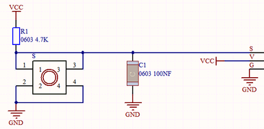
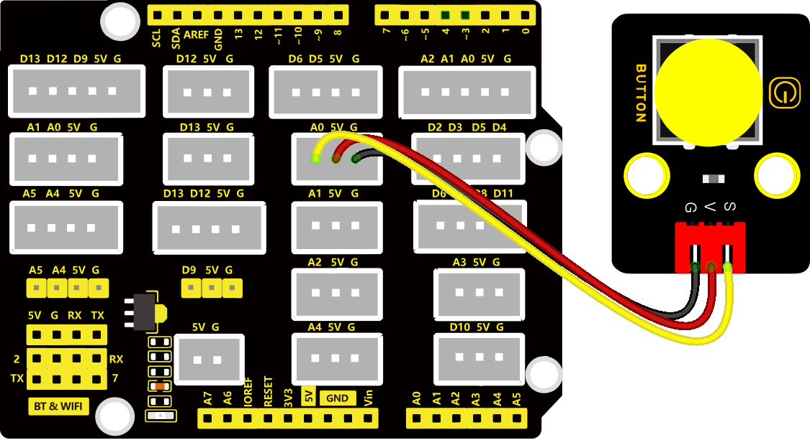
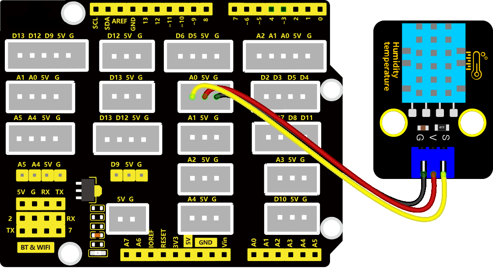
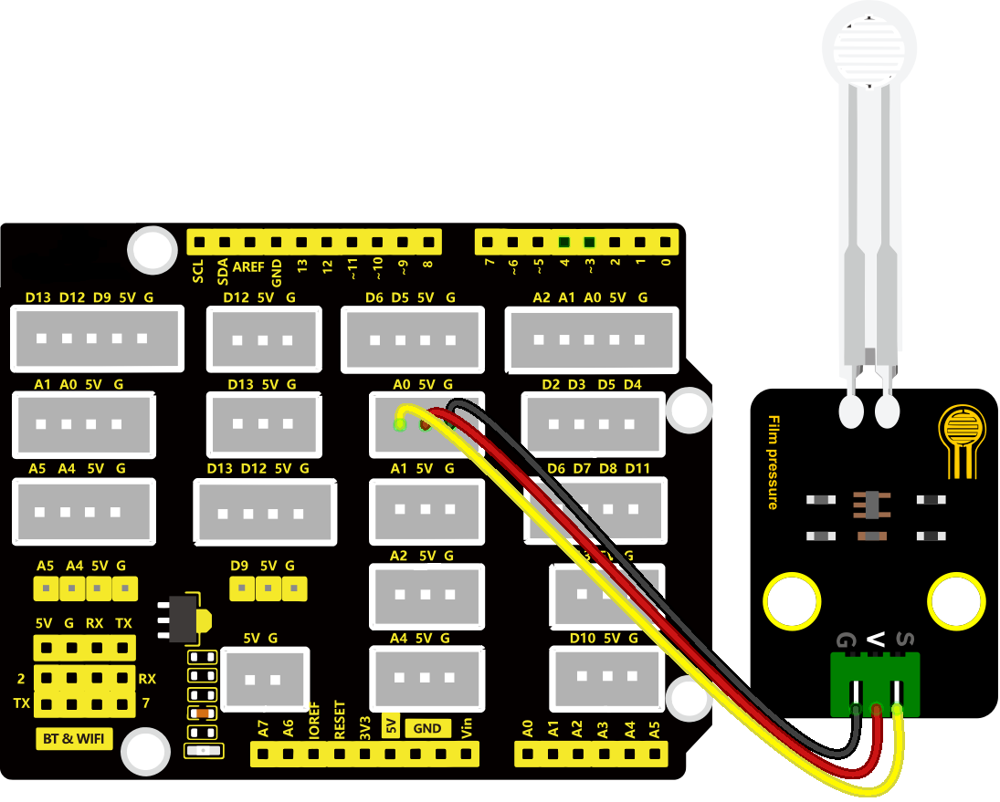
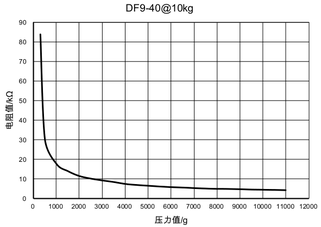

# KidsBlock_教程

## 开发环境配置

**这一部分很重要，一定要先读取并且操作这一部分内容再到项目课程。**

 

### 1. KidsBlock 软件的下载、安装和使用方法

参考链接：[https://www.keyesrobot.cn/projects/KidsBlock/en/latest/](https://www.keyesrobot.cn/projects/KidsBlock/en/latest/)

注意：本教程选用的是“**Keyes Plus development board**”主控板，打开KidsBlock软件，点击进入**设备**选择页面，找到并点击选中““**Keyes Plus development board**”主控板，这样就可以进入对应的编程界面。

将主板用USB线连接接到电脑上，然后点击来连接对应的串口端口。

点击切换成。

### 2. 添加 KidsBlock 库文件

在前面(即第1步)操作完后，在编程界面左下角点击进入库文件添加界面。

点击“**传感器**”，寻找到“**DHT sensor**”并且点击选中。

点击“**显示器**”，寻找到“**DHT sensor**”并且点击选中。

上述所有的库文件添加完后，点击KidsBlock软件左上角的返回编程界面。这样，就可以在编程界面的左侧看到所添加的所有库文件。

## 项目课程

### 第1课 蜂鸣器模块

**1. 项目介绍：**

有源蜂鸣器模块上的有源蜂鸣器元件可以发出声音，有源蜂鸣器元件内部自带震荡电路，使用时，我们只需要给蜂鸣器元件足够的电压，蜂鸣器就会自动响起。

**2. 规格参数：**

工作电压：DC 3.3 ~ 5V 

工作电流：22.5mA

最大功率：0.12W

频率：2300HZ

控制信号：数字信号

工作温度：-10°C ~ +50°C

尺寸：32mm x 23.8mm x 12.3mm

接口：2.54mm间距，3pin防反接口

**3. 原理图：**

从原理图我们可以得知，蜂鸣器的1脚通过串联一个电阻R2连接到电压正极；蜂鸣器的2脚连接到NPN三极管Q1的C极，集电极；Q1的B极，也就是基极通过串联一个电阻R1连接到S信号端；发射集接到GND。

当三极管Q1导通时，蜂鸣器的2脚连通GND，有源蜂鸣器便会工作。那么如何让三极管Q1导通呢？**NPN三极管的导通条件是基极（B）电压比发射极（E）电压高 0.3V 以上，**只需要基极（B）被上拉至高电平即可。虽然三极管Q1的基极（B）有一个下拉电阻R3导致其不导通，但是R3电阻的阻值大，使其为弱下拉电阻。三极管Q1的基极（B）还连接了一个阻值小的强上拉电阻R1，只要我们用单片机IO口给S信号端输入高电平，强上拉电阻R1会将三极管Q1的基极（B）强上拉为高电平，三极管Q1就会导通，有源蜂鸣器就会工作。

**4. 连接图：**

**5. 实验代码：**

① 在事件栏拖出Arduino启动模块。

② 在引脚栏拖出设置引脚模块，并设置引脚为A0模式为输出。

③ 在控制栏拖出重复执行模块。

④ 在引脚栏拖出设置引脚输出模块，设置引脚A0，输出高电平。

⑤ 在控制栏拖出延时模块，设置延时2秒。

⑤ 在引脚栏拖出设置引脚输出模块，设置引脚A0，输出低电平。

⑥ 在控制栏拖出延时模块，设置延时2秒。

完整代码：

**6. 测试结果：**

有源蜂鸣器只需要有个高电平电压蜂鸣器就响起。烧录好代码，连接好线，上电后，有源蜂鸣器响2S，静音2S，循环交替。

### 第2课 按键模块

**1. 项目介绍：**

本传感器兼容各种单片机控制板，如arduino系列单片机。它的连接端口兼容arduino传感器扩展板。传感器输入一个按键信号，可以输出一个数字电压信号。当我们按下按键时传感器信号端输出低电平信号，释放按键时传感器信号端保持高电平。传感器自带2个4.8mm的定位孔，方便你将传感器固定在其他设备。

**2. 规格参数：**

工作电压：3.3-5V（DC）

工作电流：10MA

输出信号：数字信号

工作温度：-10°C ~ +50°C

尺寸：32mm x 23.8mm x 12.3mm

接口：2.54mm间距，3pin防反接口

**3. 电路图：**

按键模块上的按键没有按下时，VCC经过R1给到S端的电压是高电平，当按键按下后，S端与GND导通电压被拉低了，所以是低电平，R1的作用是避免VCC和GND直接短路。

**4. 连接图：**

**5. 实验代码：**

① 在事件栏拖出Arduino启动模块。

② 在串口栏拖出设置串口波特率模块设置波特率为“9600”；在引脚栏拖出设置引脚模式模块，设置为引脚A0为输入。

③ 在控制栏拖出重复执行模块。

④ 在控制栏拖出判断模块，然后再判断模块里添加运算的等于模块，等于模块的左边添加读取数字引脚A0模块，右边为0；满足条件串口打印“Key Down!”，不满足串口打印“Wait for the key to be pressed!”。

完整代码：

**6. 实验结果：**

按照上图接好线，烧录好代码； 打开arduino IDE的串口监视器，并点击设置波特率为9600，没有按下按键时串口打印“Wait for the key to be pressed!” ；按下按键后打印“Key Down!”如下图：

### 第3课 人体红外热释传感器

**1. 项目介绍：**

Keyes 人体红外热释传感器，它主要由一个RE200B-P传感器元件组成。它是一款基于热释电效应的人体热释运动传感器，能检测到人体或动物身上发出的红外线，配合菲涅尔透镜能使传感器探测范围更远更广。

实验中，通过读取模块上S端高低电平，判断附近是否有人在运动；并且在串口监视器上显示测试结果。

**2. 规格参数：**

工作电压: DC 3.3V~5V 

工作电流: 3.6mA

最大功率: 0.018W

静态电流: <50 uA

输出信号: 数字信号

视野角度：Y = 90°，X = 110°（视野角度为理论数值）

最大检测距离: ≤5米

工作温度：-10°C ~ +50°C

尺寸：32mm x 23.8mm x 7.4mm

接口：2.54mm间距为，3pin防反接口

**3. 电路图：**

这个模块的原理图可能较前面的模块稍复杂，我们一部分一部分来看。先看电压转换部分，作用是将5V输入电压转换为3.3V输入电压。因为我们模块上用到的热释电红外传感器的工作电压是3.3V，不能直接用5V电压供电使用。有了这个电压转换部分，3.3V输入电压和5V输入电压都适用于此热释电红外传感器。

当红外热释传感器没有检测到红外信号时，红外热释传感器的1脚输出低电平，此时模块上的LED两端有电压差，有电流流过，LED被点亮，MOS管Q1导通（Q1是NPN MOS管，型号为2N7002。由于红外热释传感器的1脚输出低电平，所以Q1的源极Vs=0，而Q1的栅极Vg=3.3V，于是Q1的栅极G和Q1的源极S之间的电压 Vgs = 3.3V 大于Q1的阈值电压 2.5V，Q1导通。），信号端S检测到低电平。

当红外热释传感器检测到红外信号时，红外热释传感器的1脚输出高电平，此时模块上的LED熄灭，MOS管Q1不导通，则信号端S检测到被10K上拉电阻R5拉高的高电平。

**4. 接线图：**

**5. 实验代码：**

① 在事件栏拖出Arduino启动模块。

② 在串口栏拖出设置串口波特率模块设置波特率为“9600”；在引脚栏拖出设置引脚模式模块，设置为引脚A0为输入。

③ 在控制栏拖出重复执行模块。

④ 在控制栏拖出判断模块，然后再判断模块里添加运算的等于模块，等于模块的左边添加读取数字引脚10模块，右边为0；满足条件串口栏拖出串口打印模块设置文字为"Somebody is in this area!"；当不满足条件，串口栏拖出串口打印模块设置文字为"No one!" ；在判断语句外面添加一个0.5秒的延时，作用是放慢串口的打印速度。

完整代码：

**6. 实验结果：**

按照接线图连接好线，上传代码，打开串口监视器，点击设置波特率为9600。检测到人体运动时串口监视器中显示"Somebody is in this area!"；没有检测到人体运动时串口监视器中显示"No one!"。

### 第4课 倾斜开关模块

**1. 项目介绍：**

Keyes 倾斜传感器，主要由一个倾斜开关组成，其内部带有一颗滚珠，用来监测倾斜情况。倾斜开关可以依据模块是否倾斜而输出不同的电平信号。当开关高于水平位置倾斜时开关导通，低于水平位置时开关断开。倾斜模块可用于倾斜检测、报警器制作或者其他检测。

**2. 规格参数：**

工作电压: DC 3.3V~5V 

工作电流: 4.2mA

最大功率: 0.03WW

输出信号: 数字信号

工作温度：-10°C ~ +50°C

尺寸：32mm x 23.8mm x 8mm

接口：2.54mm间距，3pin防反接口

**3. 原理图：**

Keyes 倾斜开关模块的原理非常简单，主要是利用滚珠在开关内随不同倾斜角度的变化使滚珠开关P1的引脚1和2导通或者不导通，当滚珠开关P1的引脚1和2导通时，由于1脚接GND，所以信号端S被拉低为低电平，此时红色LED和R2组成的电路形成回路，电流经过红色LED，点亮红色LED；当滚珠开关P1的引脚1和2不导通时，滚珠开关P1的引脚2被4.7K的上拉电阻R1拉高使得信号端S为高电平，电流不经过红色LED，红色LED熄灭。
**4. 接线图：**

**5. 实验代码：**

① 在事件栏拖出Arduino启动模块，在串口栏拖出设置波特率模块并设置波特率为9600。

② 在引脚栏拖出设置引脚模式模块，一个设置为引脚A0输入。

③ 在控制栏拖出重复执行模块。

④ 在控制栏拖出判断模块，然后再判断模块里添加运算的等于模块，等于模块的左边添加读取数字引脚A0模块，右边为0。

⑤ 在串口栏拖出串口打印并换行代码块，满足条件时串口打印“Normal！”，不满足时串口打印“Tilt warning！”；然后在判断语句外面放一个延时函数延时0.5秒。

完整代码：

**6. 实验结果：**

按照接线图接好线，上传代码，打开串口监视器，点击设置波特率为9600，倾斜开关模块倾斜到一边时，模块上LED灯亮，串口打印“Normal！”；模块倾斜到另一边时，模块上LED灯灭，串口打印“Tilt warning！”。

### 第5课 光敏传感器

**1. 项目介绍：**

Keyes 光敏电阻传感器，这是一个常用的光敏电阻传感器，它主要由一个光敏电阻元件组成。光敏电阻元件的阻值随着光照强度的变化而变化，此传感器就是利用光敏电阻元件这一特性，设计电路将阻值变化转换为电压变化。光敏电阻传感器可以模拟人对环境光线的强度的判断，方便做出与人友好互动的应用。

**2. 规格参数：**

工作电压: DC 3.3V~5V 

工作电流: 0.2mA

最大功率: 0.001W

输出信号: 模拟信号

工作温度：-10°C ~ +50°C

尺寸：32 x 23.8 x 7.4 mm

接口：2.54 mm间距，3pin防反接口

**3. 原理图：**

当没有光照射时，电阻大小为0.2 MΩ，光敏电阻的信号端（2脚）检测的电压接近0。随着光照强度增大，光线传感器的电阻值越来越小，所以信号端能检测到的电压越来越大。

**4. 连接图：**

**5. 实验代码：**

① 在事件栏里拖出Arduino启动模块。

② 在串口栏拖出设置串口波特率模块并设置波特率为9600。

③ 在控制栏拖出重复执行模块。

④ 在串口栏拖出串口打印模块，并添加引脚栏里的读取模拟引脚A0的模块在里面；最后添加一个延时为0.5s的延时模块。

完整代码：

**6. 实验结果：**

按照接线图接好线，上传代码，打开串口监视器，点击设置波特率为9600，便可以看到代表当前光线强弱的模拟值，如下图。

### 第6课 声音传感器

**1. 项目介绍：**

Keyes 声音传感器可以用于测试当前环境中的声音对应的模拟值，传感器上的S端是模拟输出，是麦克风的电压信号实时输出，可以通过电位器可调节信号增益。声音越大，模拟值越大，并在串口监视器上显示测试结果。

**2. 规格参数：**

工作电压: DC 3.3V~5V 

工作电流: 15mA

最大功率: 0.075W

输出信号: 模拟信号

工作温度：-10°C ~ +50°C

尺寸：32mm x 23.8mm x 10.3mm

接口：2.54mm间距，3pin防反接口

**3. 原理图：**

Keyes 声音传感器主要由一个高感度麦克风元件和LM386音频功率放大器芯片组成，高感度麦克风元件用于检测外界的声音。声波使麦克风内的驻极体薄膜振动，导致电容的变化，而产生与之对应变化的微小电压。利用LM386音频功率放大器芯片设计对高感度麦克风检测到的声音进行放大的电路，最大倍数为200倍。使用时我们可以通过旋转传感器上电位器，调节声音的放大倍数。顺时针调节电位器到尽头，放大倍数最大。

**4. 连接图：**

**5. 实验代码：**

① 在事件栏里拖出Arduino启动模块。

② 在串口栏拖出设置串口波特率模块并设置波特率为9600。

③ 在控制栏拖出重复执行模块。

④ 在串口栏拖出串口打印模块，并添加引脚栏里的读取模拟引脚A0的模块在里面；最后添加一个延时为0.2s的延时模块。

完整代码：

**6. 实验结果：**

按照连接图接好线，上传代码，打开串口监视器，点击设置波特率为9600，便可以看到声音的模拟值了，声音越大模拟值越大。如下图：

### 第7课 旋转电位器模块

**1. 项目介绍：**

Keyes 旋转电位器，它一个模拟传感器。模块上电后，我们只需选择模块上电位器就可以调节模拟输出数值。

**2. 规格参数：**

工作电压: DC 3.3V~5V 

工作电流: 0.55mA

工作功率: 0.00275W

输出信号: 模拟信号

工作温度：-10°C ~ +50°C

尺寸：32mm x 23.8mm x 28.4mm

接口：2.54mm间距，3pin防反接口

**3. 原理图：**

旋转电位器其实就是一个可以改变电阻值的电阻元件，我们这个电位器是10K的，也就是说我们可以通过旋转便可以得到0-10K的任意阻值，根据欧姆定律U=I\*R，所以我们通过改变R的阻值进行控制电压的大小。而我们的Arduino主控板会将读取到的0-5V的电压分成1024份，所以就得到了模拟值。

**4. 连接图：**

**5. 实验代码：**

① 在事件栏里拖出Arduino启动模块。

② 在串口栏拖出设置串口波特率模块并设置波特率为9600。

③ 在控制栏拖出重复执行模块。

④ 在串口栏拖出串口打印模块，并添加引脚栏里的读取模拟引脚A0的模块在里面；最后添加一个延时为0.1s的延时模块。

完整代码：

**6. 实验结果：**

按照连接图连接好线，上传代码，打开串口监视器，点击设置波特率为9600，我们便能看见旋转电位器的模拟值了，扭动旋转电位器值发生变化。如下图：

### 第8课 温湿度传感器

**1. 项目介绍：**

Keyes XHT11温湿度传感器。XHT11作为一款低价的入门级温湿度传感器，它主要由一个电阻式感湿元件和一个NTC测温元件组成。XHT11为4针单排引脚封装，采用单线制串行接口，只需加适当的上拉电阻，信号传输距离可达20米以上，Keyes XHT11温湿度传感器具有超快响应、抗干扰能力强、性价比极高等优点。

**2. 规格参数：**

工作电压: DC 3.3V~5V 

工作电流: 2.1mA

最大功率: 0.015W

温度范围: -25 ~ +60°C (± 2℃)

湿度范围: 5 ~ 95%RH（25C°左右精度为±5%RH）

输出信号: 数字双向单总线

工作温度: -25°C ~ +60°C

尺寸：32mm x 23.8mm x 9.7mm

接口：2.54mm间距，3pin防反接口

**3. 原理图：**

XHT11温湿度传感器，包括一个电阻式感湿元件和一个NTC测温元件，XHT11为4针单排引脚封装，如上图，采用单线制串行接口，只需加适当的上拉电阻，信号传输距离可达20米以上，非常适用于对精度和实时性要求不高的温湿度测量场合。

XHT11是一款含有已校准数字信号输出的温湿度复合传感器，其精度湿度±5%RH， 温度±2℃，湿度量程5 ~ 95%RH，温度量程-25 ~ +60℃。温湿度传感器应用专用的数字模块采集技术和温湿度传感技术，确保产品具有极高的可靠性和卓越的长期稳定性。

单片机与 XHT11之间的通讯和同步,采用单总线数据格式,一次通讯时间4ms左右，数据分小数部分和整数部分，具体格式在下面说明，当前小数部分用于以后扩展，现读出为零，操作流程：一次完整的数据传输为40bit，高位先出。

**XHT11温湿度传感器的单总线格式定义：**

|名称 |单总线格式定义 |
| :--: | :--: |
| 起始信号 | 微处理器把数据总线(SDA)拉低一段时间至少 18ms(最大不得超过 30ms)，通知传感器准备数据。 | 
| 响应信号| 传感器把数据总线（SDA）拉低 83µs，再接高 87µs 以响应主机的起始信号。 |
| 湿度 | 湿度高位为湿度整数部分数据，湿度低位为湿度小数部分数据 |
| 温度 | 温度高位为温度整数部分数据，温度低位为温度小数部分数据，且温度低位 Bit8 为 1 则表示负温度，否则为正温度 |
| 校验位 | 校验位＝湿度高位+湿度低位+温度高位+温度低位 |

该传感器具有品质卓越、超快响应、抗干扰能力强、性价比极高等优点。

**4. 连接图：**

**5. 实验代码：**

确保在前面已经添加好了DHT sensor库，“添加 KidsBlock 库文件”有详细教程。

① 在“事件” 栏拖出启动 arduino 模块。

② 在“串口”栏拖出设置串口波特率模块，并设置波特率为9600 ；
在“温湿度传感器”栏拖出初始化DHT引脚模块设置引脚为A0，型号为dht11。

③ 在“控制”栏拖出重复执行模块。

④ 在“串口”栏拖出串口打印模块，设置串口打印“Temperature:”不换行；将读取温度模块放到串口打印模块中并设置不换行；设置串口打印“C ”不换行（注意C后面有两个空格）

⑤ 在“串口”栏拖出串口打印模块，设置串口打印“Humidity:”不换行；将读取湿度模块放到串口打印模块中并设置不换行 ； 设置串口打印“%”不换行；在添加一个100ms的延时

完整代码：

**6. 实验结果：**

按照连接图接好线，上传代码，打开串口监视器，设置波特率为9600，便可以看到当前环境温度值和湿度值，如下图。

### 第9课 薄膜压力传感器

**1. 项目介绍：**

Keyes 薄膜压力传感器是基于新型纳米压敏材料辅以舒适杨式模量的超薄薄膜衬底一次性贴片而成，兼具防水和压敏双重功能。当传感器感知到外界压力时，传感器电阻值发生变化，我们采用电路将传感器感知压力变化的压力信号转换成相应变化强度的电信号输出。这样我们就可以通过检测电信号变化就可以得到压力变化情况。

通过采集模块上S端模拟信号，判断压力大小。模拟值越小，压力越大；并在串口监视器上显示测试结果。

**2. 规格参数：**

工作电压: DC 3.3V~5V

工作电流: 0.5mA

最大功率: 0.0025W

量程: 0~10KG

响应点: 150g

重复性: ＜±9.7%（60%负载）

一致性: ±10%

耐久性: ＞100万次

初始电阻: 大于10MΩ(无负载)

响应时间: ＜1ms

恢复时间: ＜15ms

输出信号: 模拟信号

工作温度：-10°C ~ +50°C

尺寸：32mm x 23.8mm x 7.4mm

接口：2.54mm间距，3pin防反接口

**3. 原理图：**

当传感器感知到外界压力时，传感器的电阻值发生变化。Keyes 薄膜压力传感器使用LM321运算放大器芯片将传感器感知到的压力变化的压力信号转换成相应变化强度的电信号输出，这样就可以通过检测电压信号变化得知压力变化情况。

**4. 连接图：**

**5. 实验代码：**

① 在事件栏拖出Arduino启动模块，然后在串口栏拖出串口启动波特率模块并设置为9600。

② 在控制栏拖出重复执行模块。

③ 在串口栏拖出串口打印换行代码块。

④ 在引脚栏拖出读取模拟引脚代码块，设置引脚为A0，并将代码块添加到串口打印模块中。

⑤ 在事件栏拖出延时模块，设置延时时间为0.1秒。

完整代码：

**6. 实验结果：**

按照接线图接好线，上传代码，打开串口监视器，设置波特率为9600，便能看见压力传感器的模拟值了，按压感应区便能改变模拟值，如下图：

**7. 特别注意：**

前面的值是属于压力的模拟值并非压力值，要想得到压力值方法如下：

1\. 该传感器模块利用1个传感器元件串联1个510KΩ电阻。传感器一端接5V电源，一端连接510KΩ电阻，电阻连接GND。测试时，传感器连接电阻的一端为信号端，接模拟口。

2\. 通过上述描述，我们得到电阻和模拟值的计算公式：

3\. R=（1023-A0）\* 510 / A0 ，单位为KΩ。

4\. 根据上述公式，我们得到传感器元件电阻值，观察以下压力-阻值关系图，我们可以大概得到压力值，我们没有详细公式计算出具体的压力数值。

5\. 从图片上可以观察到，压力值大于5000g时，压力值变化，电阻值几乎不变化，因此，我们建议测试时，最大压力值为5000g。

6\. 由于传感器元件感应区是凹进去的，测试时，需要将测试物体放在圆片中间的感应区域内才可以测试出结果；如果把传感器直接放在平面上，将测试物体放在传感器感应区，是测试不出结果的。因此，我们需要在传感器感应区内垫一个小物体，再将测试物体放在传感器感应区的小物体上，才能测试出结果。

### 第10课 LCD 128\*32 DOT模块

**1. 项目介绍：**

128\*32的液晶屏模块，它的驱动芯片为ST7567A，像素为128\*32。模块使用IIC通信方式，它不仅可以显示英文文字，还可以显示数字和图案等等。

为了方便设置，我们还提供一个测试代码，代码中，我们设置显示屏显示各种英文文字、常用符号和一个图案等。同时，代码中包含所有英文字母和常用符号的库，可以直接调用。

特别注意，模块的接口为蓝色的4pin自锁接口，接口间距为2.54mm，使用时，我们需要利用特定的接线连接。

**2. 规格参数：**

分辨率：128\*32

工作电压：5V

电流：100MA

最大功率：0.5W

工作温度：0摄氏度 到 40摄氏度

尺寸：47.6MM \*23.8MM

通信方式：IIC通信

亮度、对比度可通过程序指令控制

接口：4PIN接口，间距为2.54mm

**3. 原理图：**

该模块使用IIC通讯原理，底层函数我们已经封装在库里面，我们直接调用库函数就可以，如果感兴趣的话也可以去了解该模块的底层驱动。

**4. 连接图：**

**5. 实验代码：**

确保在前面已经添加好了LCD 128\*32库，“添加 KidsBlock 库文件”有详细教程。

① 在“事件”栏拖出启动 arduino 模块。

② 在“LCD 128\*32”栏拖出LCD 初始化模块。

③ 在“控制”栏拖出 重复执行模块。

④ 在“LCD 128\*32”栏拖出设置LCD显示位置模块，并设置显示位置为第0列第7行；然后再拖出LCD 显示字母模块 设置显示字符为“KEYES”。

⑤ 在“LCD 128\*32”栏拖出设置LCD显示位置模块，并设置显示位置为第1列第0行；然后再拖出LCD 显示字母模块 设置显示字符为“ABCDEFGHIJKLMNOPQR”。

⑥ 在“LCD 128\*32”栏拖出设置LCD显示位置模块，并设置显示位置为第2列第0行；然后再拖出LCD 显示字母模块 设置显示字符为“123456789+-\*/\<\>=$@”。

⑦ 在“LCD 128\*32”栏拖出设置LCD显示位置模块，并设置显示位置为第3列第0行；然后再拖出LCD 显示字母模块 设置显示字符为“%^&(){}:;'|?,.~\\\[\]”。

完整代码：

**6. 实验结果：**

按照连接图接好线，上传代码，便能看见LCD上显示我们设置好的字符了。如下图：128X32LCD模块显示屏第一行显示“KEYES”、第二行显示“ABCDEFGHIJKLMNOPQR”、第三行显示“123456789+-\*/\<\>=$@”、第四行显示“%^&(){}:;'|?,.~\\\[\]”，如下图所示：

### 第11课 门铃

**1. 项目介绍：**

扩展对传感器的使用思维，将它们结合起来做出更有意思的东西。这节课我们要做的是门铃，也就是将按键和蜂鸣器及合起来。当按下按键时，蜂鸣器便发出声音。

**2. 连接图：**

**3. 实验代码：**

① 在“事件”栏拖出 启动arduino模块。

② 在“引脚”栏拖出设置引脚模式模块，设置引脚A0为输入，设置引脚A1为输出。

③ 在“控制”栏拖出重复执行模块。

④ 在“控制”栏拖出判断模块 ；在“运算”栏拖出等于模块，放到判断语句的条件框中；在“引脚”栏拖出读取数字引脚模块设置引脚为“A0”，放到等于模块框中，等于模块右边设置为数字“0”。

⑤ 在“引脚”栏拖出设置引脚输出模块，并设置引脚为A1，放到判断模块中，如果条件满足则A1脚输出高电平；条件不满足则A1脚输出低电平。

完整代码：

**4. 实验结果：**

按照接线图接好线，上传代码完成后，按下按键蜂鸣器便会响起。

**5. 扩展：**

上面我们的门铃是按下就一直响，想办法将它变成按下按键后门铃“滴~滴~滴~”的响呢?

### 第12课 闯入报警器

**1. 项目介绍：**

在生活中，相信大家已经对走到楼梯口灯就会自动亮起来已经习以为常了，这节课就是使用人体红外热释传感器与蜂鸣器做一个有人闯入就会报警的设备。

**2. 连接图：**

**3. 实验代码：**

① 在“事件”栏拖出 启动arduino模块。

② 在“引脚”栏拖出设置引脚模式模块，设置引脚A0为输入，设置引脚A1为输出。

③ 在“控制”栏拖出重复执行模块。

④ 在“控制”栏拖出判断模块 ；在“运算”栏拖出等于模块，放到判断语句的条件框中；在“引脚”栏拖出读取数字引脚模块设置引脚为“A0”，放到等于模块框中，等于模块右边设置为数字“1”。

⑤ 在“引脚”栏拖出设置引脚输出模块，并设置引脚为A1，放到判断模块中，如果条件满足则A1脚输出高电平；条件不满足则A1脚输出低电平。

完整代码：

**4. 实验结果：**

按照连接图接好线，上传代码，当传感器前方有人移动时蜂鸣器便会响起

### 第13课 压力报警器

**1. 项目介绍：**

这一课我们学习薄膜压力传感器与蜂鸣器的搭配，当压力过了一定值时蜂鸣器便发声报警。

**2. 连接图：**

**3. 实验代码：**

① 在“事件”栏拖出启动 arduino 模块。

② 在“引脚”栏拖出设置引脚模式模块，并设置引脚为A1模式为 输出
；在“变量”栏拖出设置全局变量代码块。

③ 在“控制”栏拖出重复执行模块。

④ 在“变量”栏拖出设置变量模块；在“数据”栏拖出映射模块，添加到设置设置变量模块中；在“引脚”栏拖出读取模拟引脚模块，设置引脚为A0，然后添加到映射模块的第一格里，然后设置映射模块的数据为“从（1023,0）到（0,1023）”。

⑤ 在“控制”栏拖出判断模块；在“运算”栏拖出大于模块并在大于模块的左边边格子添加“item”变量，右边边设置数字600。

⑥ 在“引脚”栏拖出设置引脚输出模块，如果满足条件则A1脚输出高电平，不满足则输出低电平。

完整代码：

**4. 实验结果：**

按照连接图接好线，上传代码，当按压薄膜压力传感器的感应区的力度大于模拟值的600时蜂鸣器便会发声报警。

### 第14课 LCD仪表盘

**1. 项目介绍：**

我们有很多个传感器需要看数值，而又不能一直拿着电脑看，这时候LCD模块就起作用了，可以利用它来显示各种数据。

**2. 连接图：**

**3. 实验代码：**

事先添加dxt11传感器和LCD 128\*32模块的代码块，“添加 KidsBlock 库文件”有详细教程。

① 在“事件”栏拖出 启动arduino 模块。

② 添加dht11初始化模块，并设置引脚为10，型号为dht11； 然后添加LCD 128\*32的初始化模块。

③ 在“控制”栏拖出 重复执行模块。

④ 添加一个设置LCD 显示位置模块设置显示位置为第0行，第0列（这样显示的字符或数字将会在第0行的第0列开始显示）；在添加一个LCD显示字符模块设置显示字符为“humidity:” ；添加设置显示位置模块设置为 第0行，第10列 ；添加LCD显示数字模块，然后将dht11的读取湿度模块添加到显示数字模块中。最后的延时模块只是用于区分开每一行的显示代码块，这样方便寻找些。

⑤ 添加一个设置LCD 显示位置模块设置显示位置为 第1行，第0列；在添加一个LCD显示字符模块设置显示字符为“temperature:” ；添加设置显示位置模块设置为 第1行，第13列 ；添加LCD显示数字模块，然后将dht11的读取温度模块添加到显示数字模块中。最后的延时模块只是用于区分开每一行的显示代码块，这样方便寻找些。

⑥ 添加一个设置LCD 显示位置模块设置显示位置为 第2行，第0列；在添加一个LCD显示字符模块设置显示字符为“Luminance:” ；添加设置显示位置模块设置为 第2行，第11列 ； 添加LCD显示数字模块，然后将读取模拟引脚A2模块添加到显示数字模块中。最后的延时模块只是用于区分开每一行的显示代码块，这样方便寻找些。

⑦ 添加一个设置LCD 显示位置模块设置显示位置为 第3行，第0列；在添加一个LCD显示字符模块设置显示字符为“Analog:” ；添加设置显示位置模块设置为 第3行，第8列 ； 添加LCD显示数字模块，然后将读取模拟引脚A1模块添加到显示数字模块中。最后的延时模块只是用于区分开每一行的显示代码块，这样方便寻找些。

完整代码：

**4. 实验结果：**

按照连接图接好线，上传代码，便能看见LCD上显示我们需要的传感器值了。如下图：128X32LCD模块显示屏第一行显示湿度、第二行显示温度、第三行显示光亮度、第四行显示电位器的模拟值，如下图所示：

