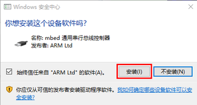
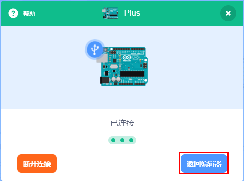
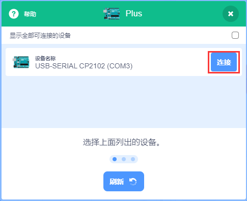
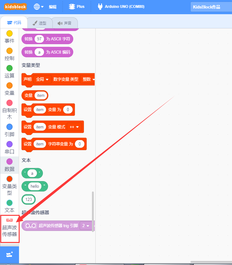
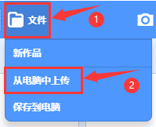
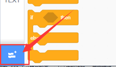
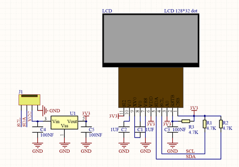
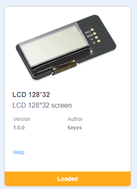

# scartch 教程

## 开发环境配置

### 第一小节 KidsBlock软件安装 

软件下载链接

Windows系统软件：https://pan.baidu.com/s/1JJOss8q2zXNsObw24BHn3w

提取码：keye

Mac系统软件链接：https://pan.baidu.com/s/1Q7uXmj3mIDDqWz20om6YJw

提取码：keye

注意：这里是以Windows系统为例，macOS 系统可以以此作为参考。

（1）双击下载好的软件“KidsBlock Desktop 1.1.4 Setup.exe”。

（2）先选中“为使用这台电脑的任何人安装”，再点击“下一步”。

（3）先点击“浏览（B）...”,选择安装的位置（我这里选择安装在C盘，你也可以选择安装在电脑的其他盘），再点击“安装”。这样，软件就在安装过程中。

（4）几秒种后，安装完成。点击“完成”就可以打开安装好的软件。

（5）如果出现电脑安全警报窗口，点击“允许访问”。这样就可以打开了软件页面。

有更新软件时一般打开会自动提醒，为了软件能正常使用我们选择升级

我们也可在设置中手动更新软件

如果已经是最新版本则显示

### 第二小节 KidsBlock软件的使用方法 

（1）软件中各按钮的功能：

（2）点击可以选择语言“English”和“简体中文”。

（3）点击，选择点击“安装驱动”。（注意：如果电脑已经安装了驱动程序，则不需要再安装驱动；如果没有，则需要进行以下操作）

A.在“设备驱动程序安装向导”页面选择点击“下一页”。

2.  过一会儿，选择点击“完成”。

3.  选择点击“下一页”。

4.  选择点击“完成”。

5.  如果出现安全页面，选择点击“允许”即可，然后选择点击“Install”。

E.选择点击“安装”。

6.  过一会儿，点击“Finish”。

7.  选择点击“Extract”。

8.  选择点击“下一页”。

9.  选择点击“我接受这个协议”后，点击“下一页”。

10. 选择点击“完成”。

11. 选择“安装”。

15. 过几秒钟后，驱动安装完成，点击“确定”即可。

（4）驱动安装完后，点击进入主控板页面，可以选择需要添加的设备（控制板），本项目需要选择Uno Plus主控板。先点击Uno Plus主控板所处区域，后点击“连接”。这样Uno Plus主控板已连接上，点击“返回编辑器”回到编码编辑器。这样，我们会发现变成，同时变成，说明Uno Plus主控板和端口（COM） 都已经连接上了。

（5）假如Uno Plus主控板已经连接上后，但是没有变成，则需要手动点击来连接端口（COM）。先点击，在出现的对话页面中点击，连接成功后，会出现“已连接”页面，说明端口已连接上了。

（6）如果需要断开端口，先点击，在出现的对话页面中点击“断开连接”。这样，端口就断开了。

Uno Plus主控板和端口（COM）都已经连接上，接着点击切换模式，这样就可以将切换成。

（7）是添加传感器/模块和元件的扩展包，点击可以进入传感器/模块扩展库界面，点击传感器/模块所处区域，就可以添加对应的传感器/模块。例如需要添加超声波传感器模块，点击“超声波传感器”所处区域，“未加载”变成“已加载”，说明“超声波传感器”模块添加成功。

点击，可以回到代码编辑器界面，在模块区可以看到添加的“超声波传感器”模块。

如果需要删除“超声波传感器”模块，只需要点击再次进入传感器/模块扩展库界面，点击“超声波传感器”所处区域，“已加载”变成“未加载”，则说明“超声波传感器”模块删除成功。

其他的传感器/模块和元器件的添加和删除，方法是一样的。

（7）打开已有的SB3类型文件的方法：（推荐使用方法2，方法1打开时有时可能会丢失代码数据）

方法1：鼠标左键双击SB3类型文件，这样就可以打开SB3类型文件。例如：需要打开文件，则只需要左键双击文件就可以直接打开。

方法2：打开Kidsblock软件，点击“文件”，选择点击“从电脑中上传”，在电脑上选中需要打开的SB3类型文件（例如：文件）

### 第三小节 启动你的第一个程序 

(1)可以直接打开我们编写好的程序：点击文件下的打开然后找到目录下的程序并打开

|文件路径|文件名|
|-|-|
|Scratch教程\1. 开发环境配置\Hello_World程序|Hello_World.sb3|

（2）上传程序：选择正确串口，波特率是：9600；控制板选择uno plus开发板；然后点击上传程序，程序上传成功会提示上传成功。

（3）实验结果：左下角监视窗口每隔0.5S打印一次“Hello World”

## 项目课程

### 第1课 蜂鸣器模块

1.  项目介绍：

本模块兼容各种单片机控制板，如arduino、microbit等等。它的连接端口兼容arduino传感器扩展板。它主要由有源蜂鸣器组成，是一种一体化结构的电子讯响器，采用直流电源供电。模块接上电源后，当我们直接给信号端输入个高电平信号后，蜂鸣器响起,反之低电平关闭。模块自带2个4.8mm的定位孔，方便你将模块固定在其他设备。

2.  规格参数：

工作电压：3.3-5V（DC）

电流：50MA

工作温度：-10摄氏度 到 +50摄氏度

尺寸：31.6mmx23.7mm

接口：3PIN接口

输入信号：数字信号

3.  原理图：

原理：有缘蜂鸣器因为内部集成了多谐振荡器所以直接给直流电压就能发出声音；蜂鸣器的1脚接在VCC端，而蜂鸣器的2脚使用一个三极管进行控制，当单片机给三极管的基极（B）高电平时三极管的C极与E极导通到GND，蜂鸣器发声，单片机给三极管基极低电平时三极管的C极与E极截止，蜂鸣器停止发声。

4.  连接图：

5.  实验代码：

①在事件栏拖出Arduino启动模块

②在引脚栏拖出设置引脚模块，并设置引脚为A0模式为输出

③在控制栏拖出重复执行模块

④在引脚栏拖出设置引脚输出模块，设置引脚3，输出高电平

⑤在控制栏拖出延时模块，设置延时2秒

⑤在引脚栏拖出设置引脚输出模块，设置引脚3，输出低电平

⑥在控制栏拖出延时模块，设置延时2秒

代码：

6.  测试结果：

有源蜂鸣器只需要有个高电平电压蜂鸣器就响起。烧录好代码，连接好线，上电后，有源蜂鸣器响2S，静音2S，循环交替。

### 第2课 按键模块

1.  项目介绍：

本传感器兼容各种单片机控制板，如arduino系列单片机。它的连接端口兼容arduino传感器扩展板。传感器输入一个按键信号，可以输出一个数字电压信号。当我们按下按键时传感器信号端输出低电平信号，释放按键时传感器信号端保持高电平。传感器自带2个4.8mm的定位孔，方便你将传感器固定在其他设备。

2.  规格参数：

工作电压：3.3-5V（DC）

电流：10MA

工作温度：-10摄氏度 到 +50摄氏度

尺寸：31.6mmx23.7mm

接口：3PIN接口

输出信号：数字信

3.  电路图：

原理：按键没有按下时VCC经过R1给到S端的电压是高电平，当按键按下后S端与GND导通电压被拉低了所以是低电平，R1的作用是避免VCC和GND直接短路。

4.  连接图：

5.  实验代码：

①在事件栏拖出Arduino启动模块

②在串口栏拖出设置串口波特率模块设置波特率为“9600”；在引脚栏拖出设置引脚模式模块，设置为引脚A0为输入

③在控制栏拖出重复执行模块

④在控制栏拖出判断模块，然后再判断模块里添加运算的等于模块，等于模块的左边添加读取数字引脚3模块，右边为0；满足条件串口打印“Key Down!”，不满足串口打印“Wait for the key to be pressed!”

代码：

6.  实验结果：

按照上图接好线，烧录好代码； 打开arduino IDE的串口监视器，并点击设置波特率为9600，没有按下按键时串口打印“Wait for the key to be pressed!” ；按下按键后打印“Key Down!”如下图：

### 第3课 人体红外热释传感器

1.  项目介绍：

人体红外热释电传感器是一款基于热释电效应的人体热释运动传感器，能检测到人体或动物身上发出的红外线，配合菲涅尔透镜能使传感器探测范围更远更广。它主要采用RE200B-P传感器元件，当附近有人或者动物运动时，该模块会输出一个高电平。

传感器兼容各种单片机控制板，如arduino系列单片机。使用时，我们可以在单片机上堆叠一个传感器扩展板。传感器和自带导线连接，然后连接在传感器扩展板上，简单方便。同时，传感器自带2个直径为4.8mm的定位孔，方便你将传感器固定在其他设备。

2.  规格参数：

工作电压范围：DC 3.3V-5V

工作电流50MA

最大功率：0.3W

工作温度：-10摄氏度 到 +50摄氏度

模块尺寸：31.6mmx23.7mm

静态电流: \<50uA

接口：间距为2.54mm 3pin

控制信号：数字信号

触发方式: L 不可重复触发/H 重复触发

最大检测距离：7米

感应角度: \<100 度锥角

3.  电路图：

原理：人体都有恒定的体温，一般在
37 度，所以会发出特定波长 10μm
左右的红外线，我们的传感器就是捕捉10μM的红外线，进行判断有没有人。

4.  接线图：

5.  实验代码：

①在事件栏拖出Arduino启动模块

②在串口栏拖出设置串口波特率模块设置波特率为“9600”；在引脚栏拖出设置引脚模式模块，设置为引脚A0为输入

③在控制栏拖出重复执行模块

④在控制栏拖出判断模块，然后再判断模块里添加运算的等于模块，等于模块的左边添加读取数字引脚10模块，右边为0；满足条件串口栏拖出串口打印模块设置文字为"Somebody is in this area!"

⑤当不满足条件，串口栏拖出串口打印模块设置文字为"No one!" ；
在判断语句外面添加一个0.5秒的延时，作用是放慢串口的打印速度。

代码：

6.  实验结果：

按照接线图连接好线，上传代码，打开串口监视器，点击设置波特率为9600。检测到人体运动时串口监视器中显示"Somebody is in this area!"；没有检测到人体运动时串口监视器中显示"No one!"。

### 第4课 倾斜开关模块

1.  项目介绍：

本模块兼容各种单片机控制板，如arduino系列单片机。它的连接端口兼容arduino传感器扩展板。它主要是利用滚珠在开关内随不同倾斜角度的发化，达到触发电路的目的,从而输出高低电平；可用于倾斜检测、报警器制作或者其他检测。模块自带2个定位孔，方便你将模块固定在其他设备。

2.  规格参数：

工作电压：3.3V-5V（DC）

电流：50MA

最大功率：0.3W

工作温度：-10摄氏度 到 +50摄氏度

尺寸：31.6mmx23.7mm

接口：3PIN接口

输出信号：数字信号

3.  电路图：

原理：它的原理非常简单，附原理图，主要是利用滚珠在开关内随不同倾斜角度的发化使滚珠开关P1的引脚1和2导通或者不导通，当1和2导通时，因为1教接GND，所以信号端S为低电平，此时红色LED形成回路，将会点亮；当1和2不导通时，引脚2被4.7K的上拉电阻R1拉高而使信号端S为高电平，模块上的LED将熄灭。

4.  接线图：

5.  实验代码：

①在事件栏拖出Arduino启动模块，在串口栏拖出设置波特率模块并设置波特率为9600

②在引脚栏拖出设置引脚模式模块，一个设置为引脚A0输入

③在控制栏拖出重复执行模块

④在控制栏拖出判断模块，然后再判断模块里添加运算的等于模块，等于模块的左边添加读取数字引脚10模块，右边为0；

⑦在串口栏拖出串口打印并换行代码块，满足条件时串口打印“Normal！”，不满足时串口打印“Tilt warning！”；然后在判断语句外面放一个延时函数延时0.5秒

代码：

6.  实验结果：

按照接线图接好线，上传代码，打开串口监视器，点击设置波特率为9600，水平放置倾斜开关模块，模块上LED灯亮，串口打印“Normal！”，模块向右倾斜LED灯灭，串口打印“Tilt warning！”

### 第5课 光敏传感器

1.  项目介绍：

本传感器兼容各种单片机控制板，如arduino系列单片机。它的连接端口兼容arduino传感器扩展板。它对环境光线最敏感，输出一个模拟信号，一般用来检测周围环境的光线的亮度，触发单片机或继电器模块等。传感器自带2个定位孔，方便你将传感器固定在其他设备。

2.  规格参数：

工作电压：3.3V-5V（DC）

电流：20MA

最大功率：0.1W

尺寸：31.6mmx23.7mm

工作温度：-10摄氏度 到 +50摄氏度

接口：3PIN接口

输出信号：模拟信号

3.  电路图：

原理：当没有亮光时，电阻大小为0.2MΩ，信号端（2点）检测的电压接近0，当随着光照抢度增大，光线传感器的电阻值越来越小，所以信号端检测的电压越来越小。

4.  连接图：

5.  实验代码：

①在事件栏里拖出Arduino启动模块

②在串口栏拖出设置串口波特率模块并设置波特率为9600；

③在控制栏拖出重复执行模块

④在串口栏拖出串口打印模块，并添加引脚栏里的读取模拟引脚A0的模块在里面；最后添加一个延时为0.5s的延时模块

代码：

6.  实验结果：

按照接线图接好线，上传代码，打开串口监视器，点击设置波特率为9600，便可以看到代表当前光线强弱的模拟值，如下图。

### 第6课 声音传感器

1.  项目介绍：

本传感器兼容各种单片机控制板，如arduino系列单片机等。它的连接端口兼容arduino传感器扩展板。传感器有S端是模拟输出，是麦克风的电压信号实时输出，通过电位器可调节信号增益。传感器自带2个定位孔，方便你将传感器固定在其他设备。

2.  规格参数：

工作电压：5V（DC）

工作电流：100mA

最大功率：0.5W

工作温度：-10摄氏度 到 +50摄氏度

尺寸：31.6mmx23.7mm

接口：3PIN接口

输出信号：模拟信号

3.  电路图：

原理：声波使麦克风内的驻极体薄膜振动，导致电容的变化，而产生与之对应变化的微小电压。然后利用LM386芯片搭建合适的电路，我们对高感度麦克风检测到的声音进行放大，最大倍数为200倍。使用时我们可以通过旋转传感器上电位器，调节声音的放大倍数。调节时，顺时针调节电位器到尽头，放大倍数最大。

4.  连接图：

5.  实验代码：

①在事件栏里拖出Arduino启动模块

②在串口栏拖出设置串口波特率模块并设置波特率为9600；

③在控制栏拖出重复执行模块

④在串口栏拖出串口打印模块，并添加引脚栏里的读取模拟引脚A0的模块在里面；最后添加一个延时为0.2s的延时模块

代码：

6.  实验结果：

按照连接图接好线，上传代码，打开串口监视器，点击设置波特率为9600，便可以看到声音的模拟值了，声音越大模拟值越大。如下图：

### 第7课 旋转电位器模块

1.  项目介绍：

本模块兼容各种单片机控制板，如arduino系列单片机等等。它的连接端口兼容arduino传感器扩展板。模块上电后，我们只需选择模块上电位器就可以调节模拟输出数值。模块自带2个定位孔，方便你将模块固定在其他设备。

2.  规格参数：

工作电压：3.3-5V（DC）

电流：20MA

功率：0.1W

工作温度：-10摄氏度 到 +50摄氏度

尺寸：31.6mmx23.7mm

接口：3PIN接口

输出信号：模拟信号

3.  电路图：

原理：电位器其实就是一个可以改变电阻值的电阻元件，我们这个电位器是10K的，也就是说我们可以通过旋转便可以得到0-10K的任意阻值，根据欧姆定律U=I\*R，所以我们通过改变R的阻值进行控制电压的大小。而我们的uno板会将读取到的0-5V的电压分成1024份，所以就得到了模拟值。

4.  连接图：

5.  实验代码：

①在事件栏里拖出Arduino启动模块

②在串口栏拖出设置串口波特率模块并设置波特率为9600；

③在控制栏拖出重复执行模块

④在串口栏拖出串口打印模块，并添加引脚栏里的读取模拟引脚A0的模块在里面；最后添加一个延时为0.1s的延时模块

代码：

6.  实验结果：

按照连接图连接好线，上传代码，打开串口监视器，点击设置波特率为9600，我们便能看见旋转电位器的模拟值了，扭动旋转电位器值发生变化。如下图：

### 第8课 温湿度传感器

1.  项目介绍：

XHT11温湿度传感器，XHT11作为一款低价、入门级的温湿度传感器，常用于我们的单片机设计实例中;它应用专用的数字模块采集技术和温湿度传感技术，确保产品具有极高的可靠性与卓越的长期稳定性。传感器包括一个电阻式感湿元件和一个NTC测温元件，XHT11为4针单排引脚封装，如下图，采用单线制串行接口，只需加适当的上拉电阻，信号传输距离可达20米以上，使其成为各类应用甚至最为苛刻的应用场合的最佳选择。该产品具有品质卓越、超快响应、抗干扰能力强、性价比极高等优点。

2.  规格参数：

工作电压：3.3-5V（DC）

工作电流：50MA

最大功率：0.25W

工作温度：-25摄氏度 到 +60摄氏度

传感器尺寸：31.6mmx23.7mm

接口：3PIN接口

端口：数字双向单总线

温度范围：0-50℃±2℃

湿度范围：20-90%RH±5%RH

3.  电路图：

原理：xht11内部的相关设置已经由生产商设置好了，我们只需要根据它的时序图进行有序的读取并处理数据即可。这方面的代码我们已经写好并封装成库了，直接调用相关函数便能读取到温湿度的值。

4.  连接图：

5.  实验代码：

首先添加扩展DHT11模块，将UNO plus开发板连接到电脑，点击“No device selected”

点击UNO Plus

点击“Connect”连接UNO Plus开发板，然后点

连接成功后点击右上角的“Realtime”

然后再点击左下角的，

便可以在栏目中寻找到dht11的代码块，并点击它进行添加

①在“事件” 栏拖出启动 arduino 模块

②在“串口”栏拖出设置串口波特率模块，并设置波特率为9600 ；
在“温湿度传感器”栏拖出初始化DHT引脚模块设置引脚为A0，型号为dht11

③在“控制”栏拖出重复执行模块

④在“串口”栏拖出串口打印模块，设置串口打印“Temperature:”不换行 ；
将读取温度模块放到串口打印模块中并设置不换行 ； 设置串口打印“C
”不换行（注意C后面有两个空格）

⑤在“串口”栏拖出串口打印模块，设置串口打印“Humidity:”不换行 ；
将读取湿度模块放到串口打印模块中并设置不换行 ； 设置串口打印“%”不换行 ；
在添加一个100ms的延时

完整代码：

6.  实验结果：

按照连接图接好线，上传代码，打开串口监视器，设置波特率为9600，便可以看到当前环境温度值和湿度值，如下图。

### 第9课 薄膜压力传感器

1.  项目介绍：

薄膜压力传感器是基于新型纳米压敏材料辅以舒适杨式模量的超薄薄膜衬底一次性贴片而成，兼具防水和压敏双重功能。当传感器感知到外界压力时，传感器电阻值发生变化，我们采用电路将传感器感知压力变化的压力信号转换成相应变化强度的电信号输出。这样我们就可以通过检测电信号变化就可以得到压力变化情况。

2.  规格参数：

工作电压：DC 5V

电流：20MA

最大功率：0.1W

工作温度：-10摄氏度 到 +50摄氏度

尺寸：31.6mmx23.7mm

量程：0-5KG

响应点：150g

重复性：＜±9.7%（60%负载）

一致性：±10%

耐久性：＞100万次

初始电阻：大于10MΩ(无负载)

响应时间：＜1ms

恢复时间：＜15ms

3.  电路图：

原理：当传感器感知到外界压力时，传感器电阻值发生变化，我们采用电路将传感器感知压力变化的压力信号转换成相应变化强度的电信号输出。这样我们就可以通过检测电压信号变化就可以得到压力变化情况。

4.  连接图：

5.  实验代码：

①在事件栏拖出Arduino启动模块，然后在串口栏拖出串口启动波特率模块并设置为9600

②在控制栏拖出重复执行模块

③在串口栏拖出串口打印换行代码块

④在引脚栏拖出读取模拟引脚代码块，设置引脚为A0，并将代码块添加到串口打印模块中。

⑤在事件栏拖出延时模块，设置延时时间为0.1秒

完整代码：

6.  实验结果：

按照接线图接好线，上传代码，打开串口监视器，设置波特率为9600，便能看见压力传感器的模拟值了，按压感应区便能改变模拟值，如下图：

7.  特别注意：

前面的值是属于压力的模拟值并非压力值。

要想得到压力值方法如下：

1.  该传感器模块利用1个传感器元件串联1个510KΩ电阻。传感器一端接5V电源，一端连接510KΩ电阻，电阻连接GND。测试时，传感器连接电阻的一端为信号端，接模拟口。

2.  通过上述描述，我们得到电阻和模拟值的计算公式：

3.  R=（1023-A0）\*510/A0 单位为KΩ

4.  根据上述公式，我们得到传感器元件电阻值，观察以下压力-阻值关系图，我们可以大概得到压力值，我们没有详细公式计算出具体的压力数值。

5.  从图片上可以观察到，到压力值大于5000g时，压力值变化，电阻值几乎不变化，因此，我们建议测试时，最大压力值为5000g。

6.  由于传感器元件感应区是凹进去的，测试时，需要将测试物体放在圆片中间的感应区域内才可以测试出结果；如果把传感器直接放在平面上，将测试物体放在传感器感应区，是测试不出结果的。因此，我们需要在传感器感应区内垫一个小物体，再将测试物体放在传感器感应区的小物体上，才能测试出结果。

### 第十四课 电机驱动

1.  项目介绍：

这是一个像素为128\*32的液晶屏模块，它的驱动芯片为ST7567A。模块使用IIC通信方式，它不仅可以显示英文文字，还可以显示中文文字和图案。

为了方便设置，我们还提供一个测试代码，代码中，我们设置显示屏显示各种英文文字、常用符号和一个图案。同时，代码中包含所有英文字母和常用符号的库，可以直接调用。使用时，我们还可以在代码中设置，让英文字母和符号显示不同文字大小。为了方便设置图案显示，我们还提供一个取模软件，可将特定的图案转化成控制代码，然后直接复制到测试代码中使用。

特别注意，模块的接口为白色的4pin自锁接口，接口间距为2.54mm，使用时，我们需要利用特定的接线连接。

2.  规格参数：

分辨率：128\*32

工作电压：5V

电流：100MA

最大功率：0.5W

工作温度：0摄氏度 到 40摄氏度

尺寸：47.6MM \*23.8MM

通信方式：IIC通信

亮度、对比度可通过程序指令控制

接口：4PIN接口

3.  电路图：

该模块使用IIC通讯原理，底层函数我们已经封装在库里面，我们直接调用库函数就可以，如果感兴趣的话也可以去了解该模块的底层驱动。

4.  连接图：

5.  实验代码：

首先添加扩展128X32LCD模块，将UNO plus开发板连接到电脑，点击“No device selected”

点击UNO Plus

点击“Connect”连接UNO Plus开发板，然后点

连接成功后点击右上角的“Realtime”

然后再点击左下角的，

便可以在栏目中寻找到dht11的代码块，并点击它进行添加

①在“事件”栏拖出启动 arduino 模块

②在“LCD 128\*32”栏拖出LCD 初始化模块

③在“控制”栏拖出 重复执行模块

④在“LCD 128\*32”栏拖出设置LCD显示位置模块，并设置显示位置为第0列第7行 ；
然后再拖出LCD 显示字母模块 设置显示字符为“KEYES”

⑤在“LCD 128\*32”栏拖出设置LCD显示位置模块，并设置显示位置为第1列第0行 ；
然后再拖出LCD 显示字母模块 设置显示字符为“ABCDEFGHIJKLMNOPQR”

⑥在“LCD 128\*32”栏拖出设置LCD显示位置模块，并设置显示位置为第2列第0行 ；
然后再拖出LCD 显示字母模块 设置显示字符为“123456789+-\*/\<\>=$@”

⑦在“LCD 128\*32”栏拖出设置LCD显示位置模块，并设置显示位置为第3列第0行 ；
然后再拖出LCD 显示字母模块 设置显示字符为“%^&(){}:;'|?,.~\\\[\]”

代码：

6.  实验结果：

按照连接图接好线，上传代码，便能看见LCD上显示我们设置好的字符了。如下图：128X32LCD模块显示屏第一行显示“KEYES”、第二行显示“ABCDEFGHIJKLMNOPQR”、第三行显示“123456789+-\*/\<\>=$@”、第四行显示“%^&(){}:;'|?,.~\\\[\]”，如下图所示：

### 第11课 门铃

1.  项目介绍：

扩展对传感器的使用思维，将它们结合起来做出更有意思的东西。这节课我们要做的是门铃，也就是将按键和蜂鸣器及合起来。当按下按键时蜂鸣器遍发出声音。

2.  连接图：

3.  实验代码：

①在“事件”栏拖出 启动arduino模块

②在“引脚”栏拖出设置引脚模式模块，设置引脚A0为输入，设置引脚A1为输出

③在“控制”栏拖出重复执行模块

④在“控制”栏拖出判断模块 ；在“运算”栏拖出等于模块，放到判断语句的条件框中
；在“引脚”栏拖出读取数字引脚模块设置引脚为“A0”，放到等于模块框中，等于模块右边设置为数字“0”

⑤在“引脚”栏拖出设置引脚输出模块，并设置引脚为A1，放到判断模块中，如果条件满足则A1脚输出高电平；条件不满足则A1脚输出低电平

代码：

4.  实验结果：

按照接线图接好线，上传代码完成后，按下按键蜂鸣器便会响起。

5.  扩展：

上面我们的门铃是按下就一直响，想办法将它变成按下按键后门铃“滴~滴~滴~”的响呢?

### 第12 闯入报警器

1.  项目介绍：

在生活中，相信大家已经对走到楼梯口灯就会自动亮起来已经习以为常了，这节课就是使用人体红外热释传感器与蜂鸣器做一个有人闯入就会报警的设备。

2.  连接图：

3.  实验代码：

①在“事件”栏拖出 启动arduino模块

②在“引脚”栏拖出设置引脚模式模块，设置引脚A0为输入，设置引脚A1为输出

③在“控制”栏拖出重复执行模块

④在“控制”栏拖出判断模块 ；在“运算”栏拖出等于模块，放到判断语句的条件框中
；在“引脚”栏拖出读取数字引脚模块设置引脚为“A0”，放到等于模块框中，等于模块右边设置为数字“1”

⑤在“引脚”栏拖出设置引脚输出模块，并设置引脚为A1，放到判断模块中，如果条件满足则A1脚输出高电平；条件不满足则A1脚输出低电平

代码：

4.  实验结果：

按照连接图接好线，上传代码，当传感器前方有人移动时蜂鸣器便会响起

### 第13课 压力报警器

1.  项目介绍：

这一课我们学习薄膜压力传感器与蜂鸣器的搭配，当压力过了一定值时蜂鸣器便发声报警。

2.  连接图：

3.  实验代码：

①在“事件”栏拖出启动 arduino 模块

②在“引脚”栏拖出设置引脚模式模块，并设置引脚为A1模式为 输出
；在“变量”栏拖出设置全局变量代码块

③在“控制”栏拖出重复执行模块

④在“变量”栏拖出设置变量模块 ； 在
“数据”栏拖出映射模块，添加到设置设置变量模块中 ；
在“引脚”栏拖出读取模拟引脚模块，设置引脚为A0，然后添加到映射模块的第一格里，然后设置映射模块的数据为“从（1023,0）到（0,1023）”

⑤在“控制”栏拖出判断模块 ； 在“运算”栏拖出
大于模块并在大于模块的左边边格子添加“item”变量，右边边设置数字600

⑥在“引脚”栏拖出设置引脚输出模块，如果满足条件则A1脚输出高电平，不满足则输出低电平

代码：

4.  实验结果：

按照连接图接好线，上传代码，当按压薄膜压力传感器的感应区的力度大于模拟值的600时蜂鸣器便会发声报警。

### 第14课 LCD仪表盘

1.  项目介绍：

我们有很多个传感器需要看数值，而又不能一直拿着电脑看，这时候LCD模块就起作用了，可以利用它来显示各种数据。

2.  连接图：

3.  实验代码：

事先添加dxt11传感器和LCD 128\*32模块的代码块，第8课与第10课有详细教程

①在“事件”栏拖出 启动arduino 模块

②添加dht11初始化模块，并设置引脚为10，型号为dht11； 然后添加LCD 128\*32
的初始化模块

③在“控制”栏拖出 重复执行模块

④添加一个设置LCD 显示位置模块设置显示位置为第0行，第0列（这样显示的字符或数字将会在第0行的第0列开始显示）
；在添加一个LCD显示字符模块设置显示字符为“humidity:” ；
添加设置显示位置模块设置为 第0行，第10列 ；
添加LCD显示数字模块，然后将dst11的读取湿度模块添加到显示数字模块中。最后的延时模块只是用于区分开每一行的显示代码块，这样方便寻找些。

⑤添加一个设置LCD 显示位置模块设置显示位置为 第1行，第0列
；在添加一个LCD显示字符模块设置显示字符为“temperature:” ；
添加设置显示位置模块设置为 第1行，第13列 ；
添加LCD显示数字模块，然后将dst11的读取温度模块添加到显示数字模块中。最后的延时模块只是用于区分开每一行的显示代码块，这样方便寻找些。

⑥添加一个设置LCD 显示位置模块设置显示位置为 第2行，第0列
；在添加一个LCD显示字符模块设置显示字符为“Luminance:” ；
添加设置显示位置模块设置为 第2行，第11列 ； 添加LCD显示数字模块，然后将
读取模拟引脚A2模块
添加到显示数字模块中。最后的延时模块只是用于区分开每一行的显示代码块，这样方便寻找些。

⑦添加一个设置LCD 显示位置模块设置显示位置为 第3行，第0列
；在添加一个LCD显示字符模块设置显示字符为“Analog:” ；
添加设置显示位置模块设置为 第3行，第8列 ； 添加LCD显示数字模块，然后将
读取模拟引脚A1模块
添加到显示数字模块中。最后的延时模块只是用于区分开每一行的显示代码块，这样方便寻找些。

代码：

4.  实验结果：

按照连接图接好线，上传代码，便能看见LCD上显示我们需要的传感器值了。如下图：128X32LCD模块显示屏第一行显示湿度、第二行显示温度、第三行显示光亮度、第四行显示电位器的模拟值，如下图所示：

