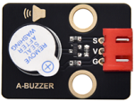
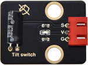
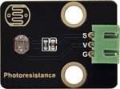
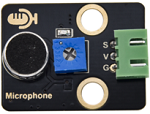
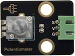
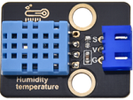

首先感谢选择keyes产品,

我们将继续为你提供好的产品和服务!

关于keyes

Keyes是KEYES Corporation旗下最畅销的品牌，我们的产品包括Arduino开发板、扩展板、传感器模块；树莓派、micro：bit扩展板和智能小车；以及为各阶段客户设计的完整入门套件。这些入门套件旨在为任何水平的客户学习Arduino、树莓派、micro：bit相关知识。

我们所有产品，均符合国际质量标准，在世界各地不同市场中，得到了极大的赞赏。

欢迎从我们的官方网站查看更多内容：

[www.keyes-robot.com](http://www.keyes-robot.com)

售后服务

1\. 如果发现某些东西丢失或损坏，或者学习套件时遇到一些困难。keyes会提供免费和快速的支持，如果您有任何疑问，请联系我们专业的销售人员。

2\. 欢迎提出建议和反馈，我们会根据您的反馈不断更新套件和教程，以使其更好。谢谢！

产品安全

1.本产品可能内含细小的零件（螺丝，铜柱等），请放在儿童接触不到的地方，防止划伤或误食。8岁及以下儿童使用，请在大人监督下使用。

2.本产品包含导电部件(控制板和电子模块），请按照本教程的要求进行操作，不当的操作可能导致过热并且损害零件，请勿触摸并立即断开电路电源。

版权

keyes商标和徽标是KEYES DIY ROBOT co.,LTD的版权,任何人和公司在没有授权的情况下，不得复制，售卖，转卖，keyes品牌的产品。如果您有兴趣在当地售卖我们的产品，请联系我们专业的批发销售人员。

# 产品介绍

为了基于Keyes arduino 4WD 麦克纳姆轮小车能够学习更多的传感器，我们特地为它搭配了这个学习套件，套件中包含了蜂鸣器，按键，人体红外热释传感器，倾斜开关，光敏传感器，声音传感器，旋转电位器，温湿度传感器，薄膜压力传感器，LCD 128\*32显示屏，涵盖了数字信号输入输出，模拟信号输入，单总线数据传输，IIC总线数据传输。我们为每个传感器搭配了 3 种语言（Arduino C 语言 + Mixly图形化编程 + KidaBlock图形化编程）的学习教程，教程包含实验原理说明，接线方法，实验代码等，让你更好的了解这些传感器。

# 产品特点

本产品涵盖了多种数字传感器和模拟传感器，多种数据传输方式。使用这些传感器搭配了一些常见的功能如：门铃，闯入可以实现蜂鸣器鸣叫等。开拓视野放开想象，能用它搭配出许多有趣的实验。

# 产品参数

连接器端口输入：DC 5V

工作温度范围：0-50℃

环保属性：ROHS

# 注意事项

1\. 如果你是plus麦克纳姆轮车的使用者，在使用这款传感器套件时必须将小车上的 3 路循迹传感器的排线拔掉，否则会起冲突的。

2\. 如果 KidsBlock 软件上的LCD 128\*32 代码块没有“液晶显示屏显示数值”指令方块，请点击[KidsBlock 软件的下载、安装和使用方法](https://www.keyesrobot.cn/projects/KE3052/en/latest/docs/KidsBlock_%E6%95%99%E7%A8%8B/KidsBlock_%E6%95%99%E7%A8%8B.html#id2) 中的方法进行更新。

# 产品清单 

|序号|图片|规格|数量|
|-|-|-|-|
|1||Keyes DIY电子积木 有源蜂鸣器模块|1|
|2||Keyes DIY电子积木 单路按键模块|1|
|3||Keyes DIY电子积木 倾斜传感器|1|
|4||Keyes DIY电子积木 人体红外热释传感器|1|
|5||Keyes DIY电子积木 光敏电阻传感器 |1|
|6||Keyes DIY电子积木 声音传感器 |1|
|7||Keyes DIY电子积木 旋转电位器|1|
|8||Keyes DIY电子积木 XHT11温湿度传感器(兼容DHT11)|1|
|9||Keyes DIY电子积木 LCD_128X32_DOT模块|1|
|10||Keyes DIY电子积木 薄膜压力传感器|1|
|11||3P 双头XH2.54插头 L=200mm 白色|3|
|12||4P 双头XH2.54插头 L=200mm 白色|1|

# 资料下载链接

特别提醒：学习本套件的所有项目课程前，必须先下载项目课程的库文件及项目代码。

- [库文件](库文件.zip)

- [项目代码](项目代码.zip)
